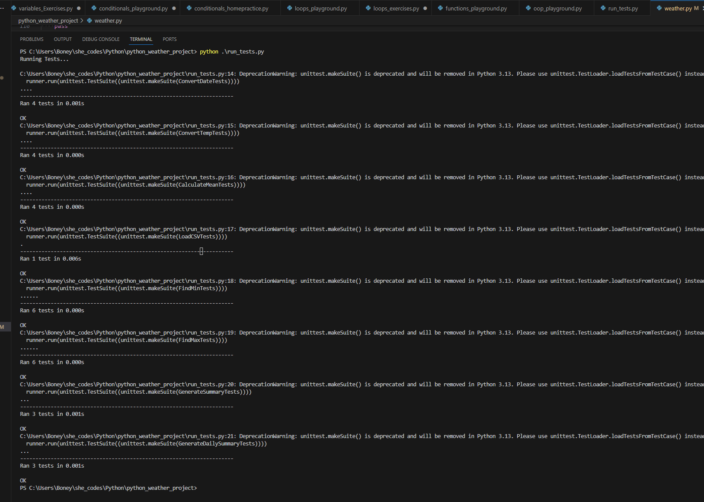

# Boney Davis - She Codes Plus Python Weather project 

[My Python weather project]( https://github.com/boneycd/python_weather_project )

## Project Requirements 
Everyday we collect data about the weather in order to predict the forecast for thecoming days. The problem is that this data is never in a human readable format, that’swhere you come in! Your task is to process csv files containing data about the weather,and convert them into meaningful text-based summaries

### Content
Functions that passed all the required tests.

#### Screenshot showing all my tests are passing

